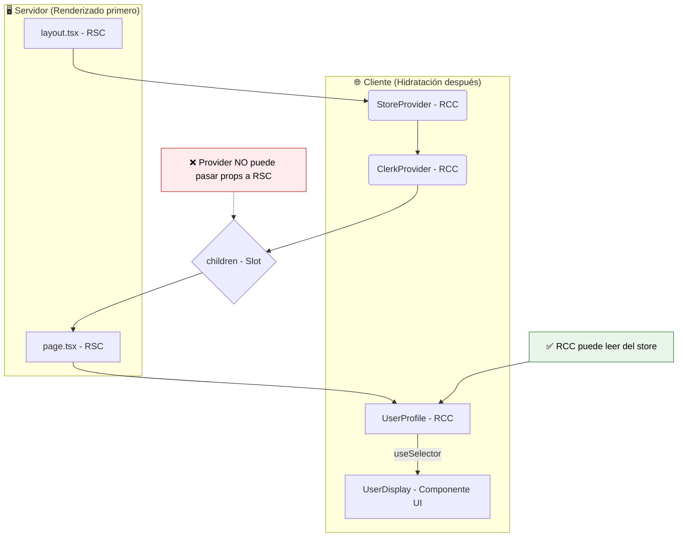

# Guía Definitiva de Componentes y Estado en Next.js (App Router)

Este documento resume los conceptos clave y las mejores prácticas para manejar la composición de componentes (RSC/RCC) y el estado del lado del cliente en una aplicación Next.js que utiliza el App Router.

## Principios Fundamentales de los Componentes

### 1. Los Providers son Client Components (RCC)

Cualquier componente que utilice React Context y/o hooks (`useState`, `useEffect`, `useContext`) para proveer un estado a sus hijos, **debe ser un Client Component**.

Esto se logra añadiendo la directiva `"use client"` al principio del archivo.

### 2. Los Providers no "Convierten" a sus Hijos

Envolver un Server Component (RSC) con un Client Component (RCC) **no convierte al hijo en un Client Component**.

-   **El Padre (Provider RCC):** Actúa como un contenedor cuyo código se ejecuta en el cliente.
-   **El Hijo (Children RSC):** Se renderiza completamente en el servidor, generando HTML estático. Este HTML se pasa como una prop (`children`) y se inserta en el "hueco" que el padre ha definido.

### 3. Componentes que Leen/Escriben Estado DEBEN ser Client Components

Cualquier componente que necesite interactuar directamente con un estado del lado del cliente (Redux, Clerk) **debe ser un Client Component**.
La razón es que necesitan usar **hooks** (`useSelector`, `useUser`, etc.), y los hooks solo funcionan en RCC.

### 4. Reglas de Composición y Paso de Props

Esta es una de las partes más importantes de la arquitectura de Next.js. El flujo de renderizado es unidireccional (Servidor -> Cliente).

-   **RSC puede renderizar a RSC (✅ SÍ):** Escenario estándar. Un padre RSC pasa props a un hijo RSC. Todo ocurre en el servidor.

-   **RSC puede renderizar a RCC (✅ SÍ):** Un padre RSC puede importar un RCC y pasarle props serializables (strings, números, objetos simples). El RSC se renderiza en el servidor y le pasa las props al RCC para que se hidrate en el cliente.

-   **RCC NO puede renderizar a RSC (❌ NO):** Un Client Component no puede importar y renderizar directamente un Server Component. El código del RSC no existe en el navegador. Sería como intentar llamar a una función de backend desde el frontend directamente.

-   **El Patrón del "Slot" (`children`):** La forma correcta de anidar un RSC dentro de un RCC es que un **componente ancestro (RSC)** renderice ambos y pase el RSC como `children` al RCC.

    ```tsx
    // Abuelo (RSC)
    import ClientWrapper from './ClientWrapper'; // RCC
    import ServerInfo from './ServerInfo';     // RSC

    export default function Page() {
      return (
        // El RCC (ClientWrapper) recibe al RSC (ServerInfo) a través de props.
        // No lo está importando ni renderizando él mismo.
        <ClientWrapper>
          <ServerInfo />
        </ClientWrapper>
      );
    }
    ```

### 5. ¿Por qué un Provider NO puede pasar props a un Server Component?

Esta es una pregunta fundamental que surge frecuentemente. La respuesta es **NO**, y la razón está en el orden y lugar donde se ejecutan los componentes:

#### El Problema del Timing de Renderizado

Cuando tienes un layout con un Provider (Redux, Context, etc.) que envuelve a `children`, y ese `children` es un Server Component (como `page.tsx`), el flujo es el siguiente:

1. **Renderizado en el Servidor (Server-Side Rendering):**
   - Next.js primero renderiza los **Server Components** en el servidor
   - El `page.tsx` (Server Component) se ejecuta y se transforma en una representación estática (RSC Payload)
   - En este punto, el `page.tsx` ya ha terminado su trabajo y no tiene conocimiento de ningún estado del lado del cliente

2. **Envío al Cliente:**
   - Next.js envía el HTML/RSC Payload resultante al navegador
   - Para los Client Components como tu `Provider`, envía instrucciones para que el navegador los haga interactivos

3. **Hidratación en el Cliente (Client-Side):**
   - El `Provider` se ejecuta en el navegador y crea el estado (Redux store, etc.)
   - Sin embargo, el `children` que recibió (`page.tsx`) ya es una pieza estática renderizada en el servidor
   - El `Provider` no puede "inyectar" props en él retroactivamente

#### Ejemplo Visual del Problema

```tsx
// ❌ ESTO NO FUNCIONA
// layout.tsx (RSC)
export default function Layout({ children }) {
  return (
    <ReduxProvider> {/* RCC - se ejecuta en el cliente */}
      {children}     {/* RSC - ya renderizado en el servidor */}
    </ReduxProvider>
  );
}

// El Provider no puede pasar props al children porque:
// 1. El children ya se renderizó en el servidor
// 2. El Provider se ejecuta después, en el cliente
// 3. No hay forma de "volver atrás" y modificar el RSC
```

#### La Solución Correcta

En lugar de intentar pasar props desde el Provider al Server Component, el patrón correcto es:

1. **El Server Component se encarga de la estructura y datos del servidor**
2. **Componentes Client específicos consumen el estado del Provider**

```tsx
// ✅ PATRÓN CORRECTO

// page.tsx (RSC)
export default async function Page() {
  // Datos del servidor
  const serverData = await fetch('api/data');
  
  return (
    <main>
      <h1>Título renderizado en el servidor</h1>
      
      {/* Este componente SÍ puede acceder al Redux store */}
      <UserProfile />
      
      {/* Pasar datos del servidor como props */}
      <InteractiveComponent initialData={serverData} />
    </main>
  );
}

// components/UserProfile.tsx (RCC)
'use client'
import { useSelector } from 'react-redux';

export default function UserProfile() {
  // Ahora SÍ podemos usar hooks para acceder al store
  const user = useSelector(state => state.user);
  return <div>Usuario: {user.name}</div>;
}
```

#### Resumen de la Limitación

**El flujo de renderizado es unidireccional (Servidor → Cliente).** Una vez que un Server Component se ha renderizado en el servidor, se convierte en contenido estático. Los Client Components que se ejecutan posteriormente en el cliente no pueden modificar retroactivamente ese contenido estático.

## Patrón Recomendado: Aislar la Lógica de Cliente

Para maximizar el uso de Server Components, sigue este patrón:

1.  **Mantén las páginas como RSC siempre que sea posible.** Se encargan de la estructura y de obtener datos del servidor.
2.  **Crea componentes RCC específicos para la interactividad.** Estos componentes contendrán la lógica de estado (hooks).
3.  **Pasa datos como props.** Un RSC padre puede obtener datos y pasarlos como props a un RCC hijo. A su vez, un RCC puede leer de una store y pasar esos datos como props a un componente de UI "tonto" que no necesita saber de dónde vienen los datos.

### Flujo de Datos y Componentes



Este enfoque híbrido te permite tener lo mejor de ambos mundos: el rendimiento y la seguridad de los Server Components para la mayor parte de tu aplicación, y la interactividad y gestión de estado de los Client Components justo donde los necesitas.

## Ejemplos Prácticos Completos

### Ejemplo 1: Layout con Provider

```tsx
// app/layout.tsx (RSC)
import { ClerkProvider } from '@clerk/nextjs';
import ReduxProvider from '@/lib/store/provider'; // RCC

export default function RootLayout({
  children,
}: {
  children: React.ReactNode;
}) {
  return (
    <ClerkProvider>
      <html lang="es">
        <body>
          <ReduxProvider>
            {children} {/* Este children es un RSC renderizado en el servidor */}
          </ReduxProvider>
        </body>
      </html>
    </ClerkProvider>
  );
}
```

### Ejemplo 2: Provider de Redux (Client Component)

```tsx
// lib/store/provider.tsx (RCC)
'use client'

import { useRef } from 'react';
import { Provider } from 'react-redux';
import { makeStore, AppStore } from './store';

export default function ReduxProvider({
  children
}: {
  children: React.ReactNode;
}) {
  const storeRef = useRef<AppStore | null>(null);
  
  if (!storeRef.current) {
    storeRef.current = makeStore();
  }

  return <Provider store={storeRef.current}>{children}</Provider>;
}
```

### Ejemplo 3: Página con Componentes Híbridos

```tsx
// app/dashboard/page.tsx (RSC)
import UserStats from '@/components/user-stats'; // RCC
import ServerInfo from '@/components/server-info'; // RSC

export default async function DashboardPage() {
  // Datos obtenidos en el servidor
  const serverData = await fetch('https://api.example.com/stats');
  const stats = await serverData.json();

  return (
    <main>
      <h1>Dashboard</h1>
      
      {/* Componente que renderiza datos del servidor */}
      <ServerInfo data={stats} />
      
      {/* Componente que lee del Redux store */}
      <UserStats />
      
      {/* Combinando datos del servidor con estado del cliente */}
      <UserProfile initialData={stats.user} />
    </main>
  );
}
```

### Ejemplo 4: Componente que Lee del Store (Client Component)

```tsx
// components/user-stats.tsx (RCC)
'use client'

import { useSelector, useDispatch } from 'react-redux';
import { RootState } from '@/lib/store/store';
import { updateStats } from '@/lib/store/features/user/userSlice';

export default function UserStats() {
  const { stats, loading } = useSelector((state: RootState) => state.user);
  const dispatch = useDispatch();

  const handleRefresh = () => {
    dispatch(updateStats());
  };

  if (loading) return <div>Cargando estadísticas...</div>;

  return (
    <div>
      <h2>Estadísticas del Usuario</h2>
      <p>Puntos: {stats.points}</p>
      <p>Nivel: {stats.level}</p>
      <button onClick={handleRefresh}>Actualizar</button>
    </div>
  );
}
```

### Ejemplo 5: Componente Híbrido (Datos del Servidor + Estado del Cliente)

```tsx
// components/user-profile.tsx (RCC)
'use client'

import { useUser } from '@clerk/nextjs';
import { useSelector } from 'react-redux';
import { RootState } from '@/lib/store/store';

interface Props {
  initialData: {
    name: string;
    email: string;
  };
}

export default function UserProfile({ initialData }: Props) {
  // Estado del cliente (Clerk)
  const { user } = useUser();
  
  // Estado del cliente (Redux)
  const preferences = useSelector((state: RootState) => state.user.preferences);

  return (
    <div>
      <h2>Perfil de Usuario</h2>
      
      {/* Datos del servidor como fallback */}
      <p>Nombre: {user?.fullName || initialData.name}</p>
      <p>Email: {user?.primaryEmailAddress?.emailAddress || initialData.email}</p>
      
      {/* Estado del cliente */}
      <p>Tema: {preferences.theme}</p>
      <p>Idioma: {preferences.language}</p>
    </div>
  );
}
```

## Puntos Clave para Recordar

1. **Los Providers siempre son Client Components** - Necesitan `'use client'`
2. **Los Providers no pueden pasar props a Server Components** - El timing de renderizado lo impide
3. **Los Server Components son estáticos una vez renderizados** - No pueden ser modificados por el cliente
4. **Los Client Components pueden leer del estado** - Usando hooks como `useSelector`, `useUser`, etc.
5. **Combina lo mejor de ambos mundos** - Server Components para estructura y datos, Client Components para interactividad
